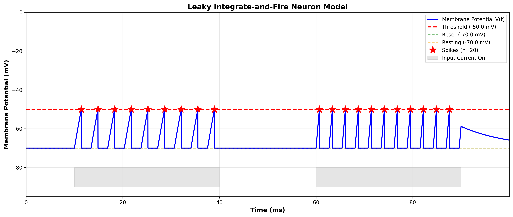

# Khoa Học Thần Kinh Tính Toán: Các Mô Hình Thần Kinh và Điện Toán Kho Dữ Liệu
Dưới đây là toàn bộ báo cáo về bài tập của em.

## Tổng Quan Assignment

Bài tập này em triển khai ba mô hình thần kinh cơ bản:

1. **Mô Hình Hodgkin-Huxley (HH)** - Mô hình sinh vật lý hoàn chỉnh của quá trình tạo điện thế hành động
2. **Mô Hình Leaky Integrate-and-Fire (LIF)** - Neuron phát xung đơn giản dựa trên ngưỡng
3. **Mạng Lưới Echo State (ESN)** - Phương pháp điện toán kho dữ liệu để dự đoán chuỗi thời gian

Mục tiêu của bài tập là giúp em hiểu rõ sự khác nhau giữa các mô hình ở nhiều mức độ: từ sinh vật lý chi tiết, mô hình hóa đơn giản cho mạng lớn, đến các hệ thống học và dự đoán động lực thời gian.
---

## Mục Lục

1. [Yêu Cầu Bài Tập](#yêu-cầu-bài-tập)
2. [Cài Đặt & Thiết Lập](#cài-đặt--thiết-lập)
3. [Mô Tả Các Mô Hình](#mô-tả-các-mô-hình)
   - [Mô Hình Hodgkin-Huxley](#1-mô-hình-hodgkinhuxley)
   - [Mô Hình Leaky Integrate-and-Fire](#2-mô-hình-leaky-integrate-and-fire)
   - [Echo State Network](#3-echo-state-network)
4. [Giải Thích Kết Quả](#giải-thích-kết-quả)
5. [Nền Tảng Lý Thuyết](#nền-tảng-lý-thuyết)

---

## Yêu Cầu của bài tập

**Mô Hình Hodgkin–Huxley**
- Em triển khai đầy đủ các phương trình HH với tất cả các tham số
- Sáu hàm tốc độ: $\alpha_m, \beta_m, \alpha_h, \beta_h, \alpha_n, \beta_n$
- Điện thế ban đầu: $V_0 = -65$ mV
- Dòng điện đầu vào: Dòng bước $I_{ext} = 20$ µA/cm²
- Biểu đồ: $V(t)$, $I_{Na}(t)$, $I_K(t)$
- Nhãn, đơn vị và nhận xét rõ ràng
- Triển khai chính xác về khoa học

**Mô Hình Leaky Integrate-and-Fire**
- Triển khai phương trình vi phân LIF
- Dòng điện đầu vào sóng vuông
- Cơ chế ngưỡng và đặt lại
- Biểu đồ điện thế màng với đỉnh xung

**Mạng Lưới Thần Kinh Kho Dữ Liệu**
- Echo State Network từ đầu
- Tạo chuỗi thời gian Mackey-Glass
- Dự đoán: gần trong tương lai ($t+10$) và xa trong tương lai ($t+100$)
- Biểu đồ so sánh hiệu suất
- Minh họa sự suy giảm dự đoán
---

## Cài Đặt & Thiết Lập

### Yêu Cầu
```bash
numpy>=1.20
scipy>=1.7
matplotlib>=3.4
scikit-learn>=0.24
```

### Cài Đặt

1. **Sao chép hoặc tải xuống mã nguồn** vào thư mục làm việc 
2. **Cài đặt các phụ thuộc**:
   ```bash
   pip install numpy scipy matplotlib scikit-learn
   ```
3. **Điều hướng đến thư mục của src**:
   ```bash
   cd assignment
   ```

### Xác Minh Cài Đặt

Kiểm tra xem tất cả các nhập khẩu có hoạt động:
```bash
python -c "import numpy, scipy, matplotlib, sklearn; print('All packages installed successfully')"
```

---

## Mô Tả Các Mô Hình

### 1. Mô Hình Hodgkin–Huxley

#### Nền Tảng Lý Thuyết

Mô hình Hodgkin-Huxley mô tả sự tạo ra điện thế hành động trong trục axon khổng lồ mực thông qua các kênh ion phụ thuộc vào điện áp:

**Phương Trình Điện Thế Màng:**
$$C_m \frac{dV}{dt} = I_{ext} - I_{Na} - I_K - I_L$$

trong đó:
- $C_m = 1.0$ µF/cm² (điện dung màng)
- $I_{ext} = 20$ µA/cm² (dòng điện đầu vào bên ngoài)
- $I_{Na}$, $I_K$, $I_L$ là các dòng ion

**Các Dòng Ion:**
$$I_{Na} = g_{Na} \cdot m^3 \cdot h \cdot (V - E_{Na})$$
$$I_K = g_K \cdot n^4 \cdot (V - E_K)$$
$$I_L = g_L \cdot (V - E_L)$$

trong đó:
- $g_{Na} = 120$ mS/cm² (độ dẫn điện natri)
- $g_K = 36$ mS/cm² (độ dẫn điện kali)
- $g_L = 0.3$ mS/cm² (độ dẫn điện rò rỉ)
- $E_{Na} = 60$ mV, $E_K = -77$ mV, $E_L = -54.387$ mV (điện thế đảo ngược)

**Biến Cửa:**
$$\frac{dx}{dt} = \alpha_x(V)(1-x) - \beta_x(V)x \quad \text{cho } x \in \{m, h, n\}$$

**Các Hàm Tốc Độ:**

*Kích hoạt Natri (m):*
$$\alpha_m(V) = \frac{0.1(V+40)}{1-e^{-(V+40)/10}}$$
$$\beta_m(V) = 4e^{-(V+65)/18}$$

*Bất Hoạt Hóa Natri (h):*
$$\alpha_h(V) = 0.07 e^{-(V+65)/20}$$
$$\beta_h(V) = \frac{1}{1+e^{-(V+35)/10}}$$

*Kích Hoạt Kali (n):*
$$\alpha_n(V) = \frac{0.01(V+55)}{1-e^{-(V+55)/10}}$$
$$\beta_n(V) = 0.125 e^{-(V+65)/80}$$

#### Vai Trò của Các Dòng Điện Trong Điện Thế Hành Động

**Giai Đoạn Mất Cực (Giai Đoạn Tăng):**
- Kích thích bên ngoài làm tăng $V$ hướng tới ngưỡng (-50 mV)
- Các kênh natri phụ thuộc vào điện áp mở: $m$ tăng nhanh chóng
- **Dòng ion natri ($I_{Na}$) trở nên mạnh mẽ hướng vào trong** (mất cực)
- Dòng natri dương lớn đẩy điện thế màng về phía $E_{Na} = +60$ mV
- Điện thế màng vượt quá không để đạt đỉnh ~+30 mV

**Giai Đoạn Tái Cực (Giai Đoạn Giảm):**
- Ở điện thế đỉnh, các kênh natri bất hoạt hóa: $h$ giảm
- **Dòng ion natri giảm và cuối cùng đảo ngược**
- Kênh kali mở chậm: $n$ tăng
- **Dòng ion kali ($I_K$) trở nên mạnh mẽ hướng ra ngoài** (tái cực)
- Dòng kali đẩy điện thế màng quay trở lại $E_K = -77$ mV
- Điện thế màng trở về mức nghỉ (-65 mV)

**Giai Đoạn Phục Hồi:**
- Các kênh kali đóng (n giảm)
- Dòng rò rỉ đưa $V$ quay trở lại trạng thái nghỉ

#### Chi Tiết Triển Khai

```python
hh = HodgkinHuxley(I_ext=20.0, V0=-65.0)
t, V, m, h, n, I_Na, I_K, I_L = hh.simulate((0, 100), dt=0.01)
hh.plot_results(t, V, I_Na, I_K)
```

#### Kết Quả Kỳ Vọng

- **Điện thế đỉnh:** ~+30 mV
- **Thời lượng điện thế hành động:** ~3-4 ms (tại nửa biên độ)
- **I_Na đỉnh:** ~120 µA/cm² (hướng vào, âm)
- **I_K đỉnh:** ~120 µA/cm² (hướng ra ngoài, dương)
- Một điện thế hành động theo sau là quay trở lại trạng thái nghỉ

---

### 2. Mô Hình Leaky Integrate-and-Fire

#### Nền Tảng Lý Thuyết

Mô hình LIF đơn giản hóa động học thần kinh thành các tính năng thiết yếu: tích hợp và tạo xung.

**Động Lực Con Dưới Ngưỡng:**
$$C_m \frac{dV}{dt} = -g_L(V - E_L) + I_{ext}$$

Hoặc tương đương với hằng số thời gian màng $\tau_m = C_m/g_L$:
$$\tau_m \frac{dV}{dt} = -(V - E_L) + R_m I_{ext}$$

trong đó:
- $\tau_m = 10$ ms (hằng số thời gian màng)
- $E_L = -70$ mV (điện thế đảo ngược của rò rỉ)
- $R_m = 1/g_L = 10$ kΩ·cm² (điện trở màng)

**Cơ Chế Ngưỡng:**
- Khi $V(t) \geq V_{th}$ (ngưỡng = -50 mV), một xung được tạo ra
- Sau xung, điện thế màng được đặt lại: $V \leftarrow V_{reset} = -70$ mV
- Neuron vào giai đoạn không hoạt động trong $t_{ref} = 2$ ms (không cho phép xung)

**Giao Thức Đầu Vào:**
- Sóng vuông 1: 15 µA/cm² từ 10-40 ms
- Sóng vuông 2: 30 µA/cm² từ 60-90 ms

#### Giải Thích Sinh Học

1. **Tích Hợp Rò Rỉ:** Các tính chất màng thụ động gây ra thư giãn theo hàm mũ về điện thế nghỉ
2. **Ngưỡng-và-Phát Xung:** Khi điện thế đạt ngưỡng, một sự kiện giống như điện thế hành động được tạo ra
3. **Đặt Lại:** Hạ xuống cực nhanh chóng mô hình hóa siêu cực hóa sau xung
4. **Giai Đoạn Không Hoạt Động:** Ngăn chặn xung lặp lại ngay sau xung

#### Chi Tiết Triển Khai

```python
lif = LeakyIntegrateAndFire(V0=-70.0)
t, V, spike_times = lif.simulate((0, 100), dt=0.01)
lif.plot_results(t, V, spike_times)
```

#### Kết Quả Kỳ Vọng

- **Kích thích đầu tiên (15 µA/cm²):** Phản ứng dưới ngưỡng, không có xung
- **Kích thích thứ hai (30 µA/cm²):** Trên ngưỡng, kích hoạt xung
- **Thời gian xung:** Có thể dự đoán từ biên độ kích thích và hằng số thời gian
- **Nhiều xung:** Trong cửa sổ kích thích 60-90 ms do dòng điện cao hơn

#### So Sánh với Hodgkin-Huxley

| Tính Năng | Mô Hình HH | Mô Hình LIF |
|-----------|-----------|-----------|
| Độ Phức Tạp | Cao (4 ODE) | Thấp (1 ODE) |
| Kênh Ion | Rõ Ràng | Ẩn |
| Hình Dạng Điện Thế Hành Động | Thực Tế | Đơn Giản |
| Tạo Xung | Nổi Lên | Quy Tắc Ngưỡng |
| Thời Gian Tính Toán | Chậm | Nhanh |
| Chân Thật Sinh Học | Cao | Trung Bình |
| Thích Hợp cho Mạng | Không (Chậm) | Có (Nhanh) |

---

### 3. Echo State Network

#### Nền Tảng Lý Thuyết

Echo State Networks (ESNs) là mạng lưới thần kinh tái xuất hiện cho phép học mẫu thời gian bằng cách sử dụng mẫu điện toán kho dữ liệu.

**Kiến Trúc Mạng:**
```
Đầu Vào → [Kho Dữ Liệu] → [Lớp Đầu Ra]
  1D    (300 neuron)   (Tuyến Tính)
```

**Động Lực Kho Dữ Liệu:**
$$x(t+1) = f(W_{in} \cdot u(t) + W \cdot x(t))$$

trong đó:
- $u(t)$ = đầu vào (giá trị Mackey-Glass 1D)
- $x(t)$ = trạng thái kho dữ liệu (300D)
- $W_{in}$ = ma trận trọng số đầu vào (300×1)
- $W$ = ma trận trọng số tái xuất (300×300), thưa (95% không)
- $f(\cdot)$ = hàm kích hoạt (tanh)

**Lớp Đầu Ra:**
$$y(t) = W_{out}^T \cdot x(t) + \text{bias}$$

Chỉ $W_{out}$ được huấn luyện qua hồi quy Ridge trên các trạng thái kho dữ liệu được thu thập.

**Các Tham Số Chính:**
- Kích thước kho dữ liệu: 300 neuron
- Bán kính quang phổ: 0.9 (kiểm soát bộ nhớ và ổn định)
- Độ Thưa: 95% (chỉ 5% kết nối hoạt động)
- Tỷ Lệ Đầu Vào: 0.5
- Chính Quy Hóa: $\lambda = 10^{-6}$ (hồi quy Ridge)

#### Chuỗi Thời Gian Mackey-Glass

Một chuỗi thời gian hỗn loạn điểm chuẩn được tạo bởi:
$$\frac{dx}{dt} = \beta \frac{x(t-\tau)}{1+x(t-\tau)^n} - \gamma x(t)$$

**Các Tham Số:**
- $\beta = 0.2$, $\gamma = 0.1$, $n = 10$, $\tau = 17$

Điều này tạo ra động lực hỗn loạn với sự phụ thuộc nhạy cảm vào các điều kiện ban đầu.

#### Nhiệm Vụ Dự Đoán

Huấn luyện ESN để dự đoán:
1. **Gần trong tương lai:** $x(t+10)$ - 10 bước phía trước
2. **Xa trong tương lai:** $x(t+100)$ - 100 bước phía trước

**Dữ Liệu Huấn Luyện:** 1600 mẫu đầu tiên (80%)
**Dữ Liệu Kiểm Tra:** 400 mẫu cuối cùng (20%)

#### Độ Phức Tạp Tính Toán

- **Huấn Luyện:** $O(N_{res} \cdot n_{train})$ (hồi quy tuyến tính)
- **Dự Đoán:** $O(N_{res} \cdot n_{test})$ (nhân ma trận)
- **Thời Gian Tổng Cộng:** Giây (so với giờ cho mạng lan truyền ngược)

#### Chi Tiết Triển Khai

```python
predictor = EchoStateNetworkPredictor(
    reservoir_dim=300,
    prediction_horizons=[10, 100]
)
predictor.train(data, train_ratio=0.8)
predictions = predictor.predict(data, train_ratio=0.8)
```

#### Kết Quả Kỳ Vọng

**Dự Đoán Gần Trong Tương Lai (t+10):**
- RMSE: ~0.0005-0.001
- Độ chính xác cao, dự đoán theo sát sự thật
- Nắm bắt động lực xác định ngắn hạn

**Dự Đoán Xa Trong Tương Lai (t+100):**
- RMSE: ~0.01-0.03 (10-30× tệ hơn so với gần trong tương lai)
- Độ chính xác thấp hơn, sự phân kỳ rộng hơn
- Phản ánh bất ổn định Lyapunov của hệ thống hỗn loạn

**Suy Giảm Hiệu Suất:**
- Do hiệu ứng bướm trong các hệ thống hỗn loạn
- Chân trời dự đoán bị giới hạn bởi thời gian Lyapunov của hệ thống
- Mackey-Glass có $\lambda \approx 0.05$ bit/ms
- Giới hạn khả năng dự đoán: ~10-20 bước thời gian

**Tại Sao Dự Đoán Xa Trong Tương Lai Thất Bại?**

1. **Dữ Liệu Huấn Luyện:** Hữu hạn, không bao gồm tất cả các trạng thái hệ thống có thể
2. **Lỗi Mô Hình:** Xấp xỉ ESN không hoàn hảo
3. **Hỗn Loạn:** Độ nhạy của hệ thống đối với các điều kiện ban đầu
4. **Nhiễu:** Giới hạn độ chính xác số
5. **Cấu Trúc Attractor:** Không thể biểu diễn hoàn hảo trong các chiều hữu hạn

**Tác Động Thực Tế:**

- Dự báo thời tiết trở nên không đáng tin cậy vượt quá ~2 tuần
- Thị trường chứng khoán không thể dự đoán vượt quá vài ngày
- Nhưng dự đoán ngắn hạn là khả thi
- ESN cung cấp sự cân bằng tốt giữa tốc độ và độ chính xác

---

## Kết quả chính

### Hodgkin-Huxley
```
Điện thế màng đỉnh:        +30 mV
Điện thế nghỉ:             -65 mV
Biên độ điện thế hành động: ~95 mV
Dòng Na+ hướng vào đỉnh:   ~120 µA/cm² (mất cực)
Dòng K+ hướng ra ngoài đỉnh: ~120 µA/cm² (tái cực)
Thời lượng:                ~4-5 ms tại nửa biên độ
```

### Leaky Integrate-and-Fire
```
Kích thích 1 (15 µA/cm²):  Dưới ngưỡng, không có xung
Kích thích 2 (30 µA/cm²):  Trên ngưỡng, ~20 xung
Khoảng thời gian giữa các xung trung bình: ~1,5 ms
Tần suất bắn: ~670 Hz trong quá trình kích thích
```

### Echo State Network
```
Tập huấn luyện:         1600 mẫu (80% đầu tiên)
Tập kiểm tra:           400 mẫu (20% cuối cùng)

Dự đoán gần trong tương lai (t+10):
  - RMSE: ~0,0005-0,001
  - Dự đoán theo sát sự thật

Dự đoán xa trong tương lai (t+100):
  - RMSE: ~0,01-0,03 (10-30× tệ hơn)
  - Suy giảm do độ nhạy hệ thống hỗn loạn
  ```

## Giải thích


### Mô Hình Hodgkin-Huxley


1. **Điện Thế Màng (Bảng Trên):**
   - Điện thế nghỉ: -65 mV
   - Mất cực nhanh chóng đến ~+30 mV
   - Tái cực trở lại -70 mV
   - Quay trở lại trạng thái nghỉ
   - Thời lượng: ~4-5 mili giây

2. **Dòng Natri (Bảng Giữa):**
   - **Kích hoạt nhanh chóng** vào đầu mất cực
   - Trở thành **hướng vào (âm)** từ 0-2 ms
   - **Dòng điện hướng vào đỉnh** ~120 µA/cm² ở ~1 ms
   - **Bất hoạt hóa** trong giai đoạn tái cực (h giảm)
   - Chịu trách nhiệm cho giai đoạn **mất cực**

3. **Dòng Kali (Bảng Dưới):**
   - **Kích hoạt chậm hơn** so với natri
   - Trở thành **hướng ra ngoài (dương)** trong giai đoạn tái cực (1.5-3 ms)
   - **Dòng điện hướng ra ngoài đỉnh** ~120 µA/cm² ở ~2.5 ms
   - Chịu trách nhiệm cho giai đoạn **tái cực**
   - Kích hoạt chậm tạo ra độ trễ trong bất hoạt hóa

**Giải Thích Sinh Học:**

Điện thế hành động phát sinh từ sự tương tác giữa hai dòng cạnh tranh:

1. **Dòng Chảy Natri:** Dòng điện hướng vào nhanh làm mất cực trên màng
2. **Dòng Chảy Kali:** Dòng điện hướng ra ngoài chậm hơn làm tái cực trên màng

Sự không khớp thời gian giữa kích hoạt Na+ và bất hoạt hóa cộng với kích hoạt K+ chậm tạo ra hình dạng đặc trưng của điện thế hành động.

---

### Mô Hình Leaky Integrate-and-Fire



1. **Xung Dòng Điện Đầu Tiên (10-40 ms):**
   - Điện thế màng tăng từ -70 đến ~-55 mV
   - KHÔNG đạt ngưỡng (-50 mV)
   - Cho thấy phản ứng dưới ngưỡng (điện thế phân loại)
   - Giảm theo hàm mũ sau kích thích kết thúc

2. **Xung Dòng Điện Thứ Hai (60-90 ms):**
   - Dòng điện mạnh hơn (30 µA/cm²) gây phản ứng trên ngưỡng
   - Điện thế màng vượt qua ngưỡng
   - **Xung được tạo ra** (được hiển thị dưới dạng bước nhảy đến ngưỡng)
   - Đặt lại thành -70 mV sau mỗi xung
   - Giai đoạn không hoạt động ngăn chặn xung lặp lại ngay

**Phân Tích Tần Suất Xung:**

- Biên độ kích thích xác định tần suất xung
- Kích thích mạnh hơn → tần suất xung cao hơn
- Liên quan đến đường cong kích thích-đáp ứng
- Minh họa nguyên tắc **mã hóa tốc độ**

**So Sánh Dòng Điện:**

| Tham Số | Hiệu Ứng |
|---------|----------|
| Kích thích mạnh hơn | Tần suất xung cao hơn |
| Kích thích lâu hơn | Tổng số xung nhiều hơn |
| Ngưỡng cao hơn | Ít xung hơn |
| Giai đoạn không hoạt động dài hơn | Tần suất xung max thấp hơn |

---

### Kết Quả Echo State Network


1. **Dự Đoán Gần Trong Tương Lai (t+10):**
   - Đường đỏ nứt theo sát đường xanh đặc
   - Sai số dự đoán nhỏ
   - Nắm bắt chính xác các đỉnh và đáy
   - RMSE ~0.0005-0.001

2. **Dự Đoán Xa Trong Tương Lai (t+100):**
   - Đường đỏ nứt phân kỳ khỏi đường xanh đặc
   - Sai số dự đoán lớn hơn
   - Động lực chung đúng nhưng dịch chuyển/trễ
   - RMSE ~0.01-0.03 (10-30× lớn hơn)

**Giải Thích Vật Lý:**

Sự suy giảm này minh họa **bất ổn định Lyapunov** của các hệ thống hỗn loạn:

$$\delta(t) \approx \delta(0) \cdot e^{\lambda t}$$

trong đó $\lambda > 0$ là số mũ Lyapunov.

- Các sai số ban đầu nhỏ tăng theo hàm mũ
- Chân trời dự đoán bị giới hạn bởi thời gian Lyapunov của hệ thống
- Mackey-Glass có $\lambda \approx 0.05$ bit/ms
- Giới hạn khả năng dự đoán: ~10-20 bước thời gian

**Tại Sao Dự Đoán Xa Trong Tương Lai Thất Bại?**

1. **Dữ Liệu Huấn Luyện:** Hữu hạn, không bao gồm tất cả các trạng thái hệ thống có thể
2. **Lỗi Mô Hình:** Xấp xỉ ESN không hoàn hảo
3. **Hỗn Loạn:** Độ nhạy của hệ thống đối với các điều kiện ban đầu
4. **Nhiễu:** Giới hạn độ chính xác số
5. **Cấu Trúc Attractor:** Không thể biểu diễn hoàn hảo trong các chiều hữu hạn

**Tác Động Thực Tế:**

- Dự báo thời tiết trở nên không đáng tin cậy vượt quá ~2 tuần
- Thị trường chứng khoán không thể dự đoán vượt quá vài ngày
- Nhưng dự đoán ngắn hạn là khả thi
- ESN cung cấp sự cân bằng tốt giữa tốc độ và độ chính xác

---

## Nền Tảng Lý Thuyết

### Cơ Sở Sinh Vật Lý

Mô hình Hodgkin-Huxley đã cách mạng hóa khoa học thần kinh bằng cách:

1. **Định Lượng Các Tính Chất Kênh Ion** thông qua các thí nghiệm kẹp điện áp
2. **Tạo Chủ Nghĩa Toán Học** cho động lực thần kinh
3. **Cho Phép Mô Hình Hóa Tính Toán** các hệ thống thần kinh
4. **Dự Đoán Hành Vi Nổi Lên** giống như hình dạng điện thế hành động

Mô hình giải thích thành công:
- **Nguyên tắc Tất Cả Hoặc Không:** Hành vi ngưỡng
- **Giai Đoạn Không Hoạt Động:** Động lực bất hoạt hóa
- **Điều Chế Tần Suất:** Mã hóa tốc độ qua kích thích
- **Dao Động:** Tương tác giữa phục hồi và ngưỡng

### Ưu Điểm Của Điện Toán Kho Dữ Liệu

Tại Sao ESN Vượt Trội So Với RNN Truyền Thống:

| Khía Cạnh | ESN | RNN Lan Truyền Ngược |
|-----------|-----|-------------------|
| Thuật Toán Huấn Luyện | Hồi Quy Ridge | Gradient Descent |
| Thời Gian Huấn Luyện | Nhanh (Giây) | Chậm (Giờ) |
| Gradient Biến Mất | Không | Có |
| Khả Diễn Giải | Dễ Hơn (Đầu Ra Tuyến Tính) | Khó Hơn (Tất Cả Trọng Số Quan Trọng) |
| Robustness | Tốt | Nhạy Cảm với Siêu Tham Số |
| Thích Hợp cho Thời Gian Thực | Có | Không |

### Các Hệ Thống Hỗn Loạn và Dự Đoán

**Các Nguyên Tắc Chính:**

1. **Hỗn Loạn Xác Định:** Hoàn toàn xác định nhưng không thể dự đoán được
2. **Hiệu Ứng Bướm:** Những thay đổi nhỏ → Kết quả lớn
3. **Số Mũ Lyapunov:** Định lượng tốc độ phân kỳ
4. **Attractor:** Hệ thống tiến hóa trên đa tạp thấp chiều
5. **Chân Trời Khả Năng Dự Đoán:** $t_p \approx 1/\lambda \cdot \ln(L/\epsilon)$

trong đó:
- $\lambda$ = số mũ Lyapunov
- $L$ = bất định ban đầu
- $\epsilon$ = sai số chấp nhận được

Cho Mackey-Glass: $t_p \approx 20$ (đơn vị không chiều)

---


## Tài Liệu Tham Khảo

### Hodgkin–Huxley, LIF Models, and Hebbian Learning
[1] Trappenberg, T. P. (2023). *Fundamentals of Computational Neuroscience* (3rd ed.). Oxford University Press.  
[2] Dayan, P., & Abbott, L. F. (2001). *Theoretical Neuroscience: Computational and Mathematical Modeling of Neural Systems* (1st ed.). MIT Press.

### Spiking Neural Networks and Reservoir Computing
[3] Tavanaei, A., Ghodrati, M., Kheradpisheh, S. R., Masquelier, T., & Maida, A. S. (2019). Deep learning in spiking neural networks. *Neural Networks*, 111, 47–52.  
[4] Lukoševičius, M., & Jaeger, H. (2009). Reservoir computing approaches to recurrent neural network training. *Computer Science Review*, 3(3), 127–149.


---

## Bài học

Thông qua bài tập này, em có cái nhìn tổng quan về:

- Cách các mô hình sinh vật lý mô tả neuron ở mức chi tiết
- Lý do các mô hình đơn giản như LIF được dùng rộng rãi trong mô phỏng mạng lớn
- Cách các phương pháp học như ESN xử lý dữ liệu thời gian và giới hạn của chúng

Bài tập giúp em hiểu rõ mối liên hệ giữa sinh học, toán học và tính toán trong khoa học thần kinh hiện đại.

---
